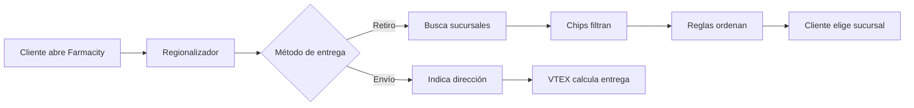
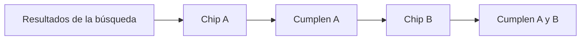
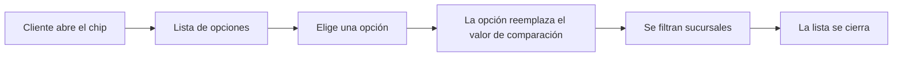
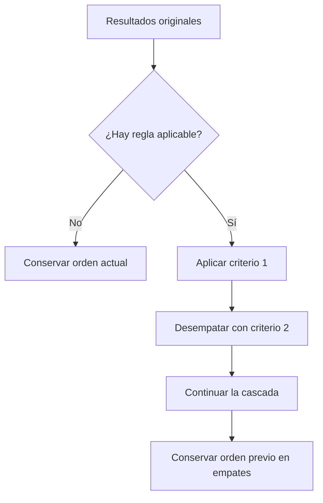

# Guía visual del Regionalizador

> Referencia rápida para configurar **chips**, **orden de sucursales** y el **banner promocional** desde VTEX Site Editor.

| Documento | Alcance |
|---|---|
| Historia | FARMA-5049 |
| Seguimiento QA | TQD-1128 |
| Ambiente de prueba | `farma5049--farmacityar.myvtex.com` |
| Fuente | `Guia-de-configuracion-Regionalizador-chips-orden-y-banner (1).pdf` |

Esta versión resume la guía funcional original. Está pensada para consultar mientras se configura o prueba el Regionalizador; ante una definición dudosa, prevalece el documento fuente y la decisión del equipo responsable.

---

## 1. El Regionalizador en un minuto

El Regionalizador es el modal donde el cliente decide **cómo** y **dónde** recibir o retirar su compra. Esa elección afecta:

- disponibilidad y stock;
- precios visibles;
- promesa de entrega;
- sucursales que puede seleccionar.



La configuración cubierta por esta guía vive en:

```text
VTEX Admin
└── Storefront
    └── Site Editor
        ├── Header Desktop
        │   └── Regionalizador
        └── Header Mobile
            └── Regionalizador
```

> [!IMPORTANT]
> Ver dos rutas en el editor no demuestra que Desktop y Mobile compartan configuración. Hay que comprobar qué instancia consume cada viewport antes de calificar una prueba.

---

## 2. Mapa del panel

De arriba hacia abajo, el bloque Regionalizador agrupa:

| Sección | Qué controla |
|---|---|
| Textos del modal | Títulos, avisos, tarjetas de entrega y monto de envío gratis. |
| Retiro en auto | Texto y logo reutilizados por el chip histórico. |
| Chips | Barra de filtros, condiciones, opciones y diseño. |
| Orden del listado | Reglas y criterios para priorizar sucursales. |
| Campos extra de MasterData | Columnas existentes que se quieren habilitar en condiciones. |
| Banner | Imagen, vigencia, destino y medición. |

### Atajo de “Retiro en auto”

Los campos generales de retiro en auto controlan el chip histórico usando el mismo logo en sus estados. Si el logo debe cambiar al seleccionarlo, hay que configurar ese chip dentro de la lista de chips, donde cada estado tiene diseño propio.

---

## 3. Chips: las cuatro reglas esenciales

Un chip sirve para **comunicar** una característica y también para **filtrar** sucursales.

### Regla 1 · Sólo aparece si es útil

Si ninguna sucursal de la búsqueda cumple la condición, el chip no se muestra.

### Regla 2 · Seleccionar filtra; quitar restaura

Al seleccionar el chip quedan las coincidencias. Al quitar el último filtro debe recuperarse la búsqueda base.

### Regla 3 · Varios chips aplican AND



No alcanza con cumplir uno: la sucursal debe cumplir **todos** los chips seleccionados.

### Regla 4 · Nunca inventa sucursales

El chip trabaja sobre el conjunto devuelto por la búsqueda. Puede quitar elementos de la vista, pero nunca agregar una sucursal externa.

> [!NOTE]
> Una combinación AND puede dejar cero resultados y ser correcta. La barra debe seguir visible y operable para que el cliente pueda quitar filtros y recuperarse.

---

## 4. Crear un chip simple

Ejemplo: **Retiro sin costo**.

### Configuración funcional

| Campo | Valor del ejemplo |
|---|---|
| Nombre interno | `Retiro sin costo` |
| Chip activo | Sí |
| Origen | `VTEX (cálculo de envío)` |
| Campo VTEX | `Retiro/envío sin costo` |
| Comparación | `es igual a` |
| Valor | `true` |
| Abre lista de opciones | No |
| Mostrar en tarjeta | Según necesidad; puede quedar en `No mostrarlo` |

### Secuencia

1. Abrir **Site Editor → Regionalizador → Chips**.
2. Presionar **AGREGAR**.
3. Completar nombre interno y condición.
4. Configurar el estado normal.
5. Configurar el estado seleccionado con una diferencia visible.
6. Presionar **APLICAR** dentro del chip.
7. Presionar **GUARDAR** en el panel general.
8. Reabrir el editor y comprobar persistencia.
9. Validar el mismo workspace en el storefront.

> [!TIP]
> Si el chip no aparece, primero probá una localidad donde exista al menos una sucursal que cumpla la condición. La ausencia puede ser el comportamiento correcto.

---

## 5. Los tres estados de un chip

| Estado | Dónde aparece | Regla visual |
|---|---|---|
| Normal | Barra, antes de seleccionar | Es el diseño base. |
| Seleccionado | Barra, con filtro activo | La X para limpiar se agrega automáticamente. |
| Dentro de tarjeta | Tarjeta de la sucursal | No lleva X ni sombra. |

La visibilidad dentro de tarjeta ofrece tres modos:

- **Siempre que cumpla:** aparece en cada tarjeta coincidente, aunque el filtro no esté seleccionado.
- **Sólo cuando el cliente seleccionó el chip:** aparece después de aplicar el filtro.
- **No mostrarlo:** nunca aparece dentro de la tarjeta.

> [!WARNING]
> La documentación no es concluyente sobre el fallback de una configuración de tarjeta completamente vacía. Para pruebas formales, cargá texto o logo explícito y tratá el caso vacío como definición pendiente.

### Campos de diseño

| Campo | Uso |
|---|---|
| Logo | Imagen opcional, propia de cada estado. |
| Texto | Contenido visible; admite HTML simple como `<strong>`. |
| Color del texto | Color de la etiqueta. |
| Ícono | Lista cerrada de íconos disponibles. |
| Orden de elementos | Secuencia con `logo`, `text`, `icon`, separados por coma. |
| Color de fondo | Relleno del chip. |
| Color del borde | Contorno; vacío significa sin borde. |
| Ancho del borde | Sólo funciona si también hay color. |
| Sombra | Estándar, sin sombra o a medida. |
| Sombra a medida | Valor CSS que debe proporcionar desarrollo. |

Ejemplos de orden:

```text
logo,text,icon  →  [logo] Retiro gratis [icono]
text,icon       →  Retiro gratis [icono]
logo,icon       →  [logo] [icono]          ← el texto cargado no se dibuja
```

---

## 6. Administrar chips sin perder configuración

| Necesidad | Acción recomendada |
|---|---|
| Editar | Abrir la fila, modificar, aplicar y guardar. |
| Pausar uno | Apagar **Chip activo**. |
| Ocultar toda la barra | Apagar **Mostrar la barra de filtros**. |
| Cambiar el orden | Arrastrar las filas de la lista. |
| Eliminar | Borrar la fila sólo si existe respaldo. |

> [!CAUTION]
> El borrado no tiene deshacer. Para sacar un chip de circulación, es más seguro desactivarlo.

### ¿Qué pasa si la lista queda vacía?

Reaparecen los cinco chips históricos como red de seguridad:

1. Venta de medicamentos.
2. Obra social.
3. Retiro gratis.
4. Farmacia 24 horas.
5. Retiro en auto.

Sólo se verán los que sean aplicables a la búsqueda. Para ocultar todos los chips, hay que apagar la barra general.

---

## 7. Chips con lista de opciones

Se usan cuando el cliente debe elegir un valor, no simplemente activar o desactivar una condición.



### Comportamiento esperado

- Elegir una opción aplica el filtro y cierra la lista.
- Elegir nuevamente la misma opción la desmarca.
- Tocar el cuerpo abre o cierra la lista.
- La X limpia la selección.
- Clic exterior o `Escape` cierran sin cambiar la selección.
- Si una opción manual no tiene texto visible, se muestra su valor de comparación.

### Origen de opciones

| Tipo | Cuándo usarlo | Configuración |
|---|---|---|
| Catálogo de obras sociales | Para el filtro de obra social | Activar catálogo y dejar vacías las opciones manuales. |
| Carga manual | Tipo de sucursal, franja horaria u otra selección | Desactivar catálogo y cargar una fila por opción. |

Cada opción manual puede tener:

- nombre interno;
- texto visible;
- valor exacto de comparación;
- logo opcional.

### Caso especial: obra social

La condición habitual es:

```text
MasterData · obraSocial · contiene · <código exacto>
```

El código debe coincidir con MasterData, no necesariamente con el nombre comercial.

En la tarjeta se muestra el logo de la obra social seleccionada. Una obra social nueva puede aparecer en el catálogo pero no tener logo en tarjeta hasta que desarrollo lo agregue.

El valor especial `$selectedObraSocial` permite usar la elección actual del cliente en otra condición o criterio de orden. Si todavía no eligió ninguna, la condición no se cumple.

---

## 8. Condiciones: cómo se decide una coincidencia

Toda condición tiene:

```text
ORIGEN + CAMPO + COMPARACIÓN + VALOR (cuando corresponde)
```

### Orígenes

| Origen | Contenido | Naturaleza |
|---|---|---|
| MasterData | Datos de la ficha de la sucursal | Cambian cuando Farmacity actualiza la tabla. |
| VTEX | Simulación logística del carrito y la ubicación | Cambia según cliente, carrito y contexto. |

### Campos frecuentes de MasterData

| Campo | Representa | Tipo |
|---|---|---|
| `type` | Tipo de sucursal | Texto |
| `obraSocial` | Códigos de obras sociales atendidas | Lista |
| `abierto24hs` | Apertura las 24 horas | Booleano |
| `autocity` | Retiro en auto | Booleano |
| `tiendaMasStock` | Tienda marcada con mayor stock | Booleano |
| `addressId` | Identificador único de la sucursal | Texto |

Se pueden habilitar otros campos mediante **Campos extra de MasterData**, siempre que la columna ya exista. Escribir un nombre allí no crea datos ni columnas.

### Campos de VTEX

| Campo | Tipo |
|---|---|
| Retiro/envío sin costo | Booleano |
| Demora de entrega en días | Número |
| Distancia hasta la sucursal | Número |
| Costo del envío | Número |
| Canal de ventas | Texto |

### Comparaciones

| Comparación | Significado | ¿Usa valor? |
|---|---|---|
| `es igual a` | Coincidencia exacta | Sí |
| `es distinto de` | El dato existe y es diferente | Sí |
| `contiene` | Elemento de una lista o fragmento de texto | Sí |
| `es mayor que` | Comparación numérica estricta | Sí |
| `es menor que` | Comparación numérica estricta | Sí |
| `tiene dato` | Existe y no está vacío | No |
| `no tiene dato` | Está vacío o no existe | No |

> [!IMPORTANT]
> Un campo ausente no cumple `es distinto de`. Tampoco cumple igualdad, contenido ni comparación numérica. Para buscar ausencias se usa `no tiene dato`.

Los límites son estrictos:

```text
valor = 1

es menor que 1  →  no cumple
es mayor que 1  →  no cumple
```

### Recetas rápidas

| Necesidad | Configuración |
|---|---|
| Retiro gratis | `VTEX · Retiro/envío sin costo · es igual a · true` |
| Farmacia 24 horas | `MasterData · abierto24hs · es igual a · true` |
| Atiende OSDE | `MasterData · obraSocial · contiene · <código OSDE>` |
| Retiro en el día | `VTEX · Demora en días · es menor que · 1` |
| Sólo puntos Farmacity | `MasterData · type · es igual a · farmacity` |
| Primero una sucursal puntual | `MasterData · addressId · es igual a · <ID>` como primer criterio |

---

## 9. Orden del listado de sucursales

> [!IMPORTANT]
> **Ordenar no es filtrar.** Una regla puede cambiar posiciones, pero nunca agregar ni quitar sucursales del resultado.

### Búsqueda por ubicación

Cuando el cliente busca por dirección, el orden natural es cercanía. Se conserva salvo que una regla tenga activado explícitamente **Aplicar a la búsqueda por dirección**.

### Alcance de una regla

| Configuración | Cuándo aplica |
|---|---|
| Provincia + localidad | Caso más específico. |
| Sólo provincia | Cuando no hay una regla de localidad más específica. |
| Sin provincia ni localidad | Regla general para búsqueda por provincia/localidad. |
| Aplicar a dirección activado | Puede reemplazar el orden por cercanía. |

### Decisión del orden



El primer criterio manda; los siguientes desempatan.

### Dos familias de criterios

| Familia | Ejemplo | Resultado |
|---|---|---|
| Cumple / no cumple | `tiendaMasStock = true` | Las que cumplen suben; las demás quedan después. |
| Orden numérico | demora de menor a mayor | Ordena por valor; los no numéricos quedan al final. |

> [!WARNING]
> La prioridad manual por ID y el alcance sobre búsqueda por dirección tienen diferencias entre la historia y la guía. No deben darse por cerrados sin reconciliar la definición funcional.

---

## 10. Banner promocional

El banner aparece en la primera pantalla del modal, debajo de las opciones de entrega.

### Cómo se elige

Se muestra el **primer banner de la lista** que cumpla simultáneamente:

```text
ACTIVO + IMAGEN CARGADA + FECHA VIGENTE
```

Esto permite dejar campañas programadas. Si dos se superponen, gana la primera en la lista.

### Campos

| Campo | Uso |
|---|---|
| Banner activo | Publica u oculta sin borrar. |
| Imagen | Obligatoria, formato WebP; una imagen para todos los dispositivos. |
| Descripción | Alternativa si no carga y soporte para lectores de pantalla. |
| Mostrar desde | Fecha y hora de Argentina; vacío significa desde ahora. |
| Mostrar hasta | Fecha y hora de Argentina; vacío significa sin fin. |
| Link | Destino opcional. |
| Nueva pestaña | Evita sacar al cliente del flujo actual. |
| Medición GA | Activa impresión y clic. |
| ID, nombre y posición | Identificadores para reportes de Analytics. |

### Vigencia

| Desde | Hasta | Comportamiento |
|---|---|---|
| Vacío | Vacío | Siempre visible mientras esté activo. |
| Con fecha | Vacío | Se activa en esa fecha y no vence. |
| Vacío | Con fecha | Se muestra ahora y vence automáticamente. |
| Con fecha | Con fecha | Sólo dentro de la ventana. |
| Posterior a “hasta” | Anterior a “desde” | Configuración inválida; nunca aparece. |

---

## 11. Qué se puede cambiar sin desarrollo

### Desde Site Editor

- textos generales del modal;
- texto y logo de retiro en auto;
- alta, edición, orden, pausa y borrado de chips;
- textos, colores, logos, bordes, sombras y orden visual;
- condiciones con datos ya disponibles;
- visibilidad dentro de tarjetas;
- opciones manuales de un desplegable;
- reglas y criterios de orden;
- habilitación de una columna existente como campo extra;
- imagen, fechas, link y medición del banner.

### Desde MasterData

- atributos de las sucursales;
- obras sociales atendidas;
- alta o baja de una sucursal.

> [!NOTE]
> Los datos de sucursales pueden quedar cacheados en el navegador hasta 24 horas. Para verificar un cambio de MasterData, usá incógnito o un navegador sin esa caché.

### Requiere desarrollo

- íconos nuevos para la lista cerrada;
- forma, alto, espaciado, redondeo o tipografía del chip;
- diseño del desplegable de opciones;
- comparaciones nuevas;
- fuentes de datos diferentes de MasterData o VTEX;
- columnas nuevas en MasterData;
- logos de obras sociales nuevas dentro de tarjetas;
- mensajes del listado, como “no encontramos sucursales”;
- ubicación del módulo dentro de la página.

---

## 12. Diagnóstico rápido

| Problema | Revisar |
|---|---|
| El chip no aparece | Barra activa → chip activo → condición completa → localidad con coincidencias. |
| El chip aparece vacío | `Orden de los elementos` debe incluir `text`, `logo` o `icon` según corresponda. |
| Seleccionado se ve igual | Configurar una diferencia en el estado seleccionado. |
| El borde no aparece | Se necesitan color **y** ancho mayor que cero. |
| No aparece en la tarjeta | Modo de tarjeta activo y estado de tarjeta con texto o logo explícito. |
| Obra social no coincide | Usar código exacto de MasterData y comparación `contiene`. |
| La regla de orden no actúa | Revisar provincia/localidad, tipo de búsqueda y campo del criterio. |
| Dirección conserva cercanía | Es correcto si la regla no activa la aplicación a dirección. |
| Dos filtros dejan cero | Puede ser una intersección AND válida; quitar uno debe recuperar resultados. |
| Cambio de MasterData no se refleja | Probar incógnito por caché de hasta 24 horas. |
| Banner no aparece | Activo → imagen → vigencia → prioridad dentro de la lista. |

---

## 13. Checklists de operación

### Antes de cambiar configuración

- [ ] Confirmar workspace y bloque Desktop/Mobile.
- [ ] Capturar la configuración original.
- [ ] Preparar sucursales y atributos reales.
- [ ] Mantener carrito y ubicación controlados.
- [ ] Evitar cambios concurrentes sobre el mismo bloque.

### Antes de aprobar un chip

- [ ] Persiste después de **APLICAR**, **GUARDAR** y recargar.
- [ ] Aparece sólo cuando existen coincidencias.
- [ ] Filtra únicamente el conjunto base.
- [ ] Se puede limpiar y recuperar el listado.
- [ ] Respeta AND con otros chips.
- [ ] Usa el estado visual correcto.
- [ ] Funciona en el viewport configurado.

### Antes de aprobar una regla de orden

- [ ] No agregó ni eliminó sucursales.
- [ ] Aplicó al alcance correcto.
- [ ] Respetó la cascada de criterios.
- [ ] Conservó el orden previo en empates.
- [ ] No alteró cercanía por dirección sin habilitación explícita.

### Antes de aprobar un banner

- [ ] Está activo y tiene imagen WebP.
- [ ] Tiene descripción accesible.
- [ ] Las fechas usan horario de Argentina.
- [ ] El primer banner vigente es el esperado.
- [ ] Link y pestaña funcionan según configuración.
- [ ] Los datos de Analytics están coordinados.

---

## 14. Regla de oro para QA

```text
CONFIGURACIÓN ≠ DATOS ≠ RESULTADO OBSERVADO
```

- La configuración dice qué debería evaluar el componente.
- MasterData y VTEX aportan los datos reales.
- El storefront muestra el resultado.

Para determinar un Pass hay que conservar evidencia de las tres capas. Una captura aislada del editor no demuestra persistencia ni filtrado, y un listado visual sin datos fuente no demuestra que la condición se haya evaluado correctamente.
